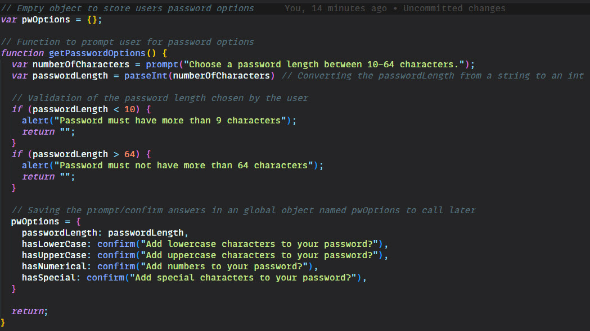

# Password Generator 🔒

Week 5's challenge saw us asked to create a Password Generator using our newly learnt JavaScript skills. The HTML/CSS framework of the generator was already provided in the starter code, so this was purely a JavaScript exercise. However, in future I will look to add more features, such as being able to copy to the clipboard etc.

## Acceptance Criteria
The acceptance crtieria for this project was as follows:

* Generate a password when the button is clicked
  * Present a series of prompts for password criteria
    * Length of password
      * At least 10 characters but no more than 64.
    * Character types
      * Lowercase
      * Uppercase
      * Numeric
      * Special characters ($@%&*, etc)
  * Code should validate for each input and at least one character type should be selected
  * Once prompts are answered then the password should be generated and displayed in an alert or written to the page

## Learning Points
This was a tough exercise, we had only just learnt about objects and functions, so putting them into use and being aware of scope was a big issue for me. 

At one point I had a great solution, however due to using a global variables, my password never cleared when generating a new one so we ended up with a monstrously large password. In order to fix this I had to make some of my variables local and that seemed to solve the issue. It did mean I had to get rid of one of my functions in order for it to work. 

## Useful Information
The page is deployed on GitHub - [Click here](https://rbrd87.github.io/password-generator)

The repository of the project is also hosted on GitHub - [Click here](https://github.com/rbrd87/password-generator)

## Demo
Here is a demonstration of how the password generator works

## Screenshots
Finally here is a little snippet of my JavaScript code

